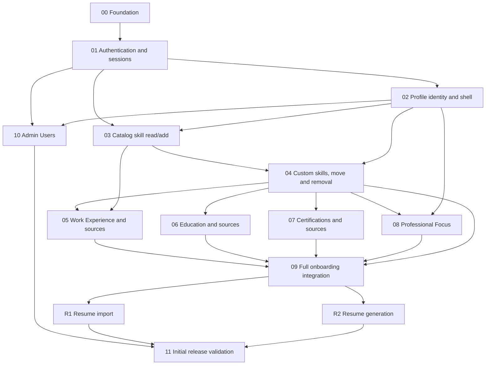

# Implementation dependencies

Status: **PLANNED**. A dependency means the consumer cannot meet its acceptance criteria without the prerequisite; it does not authorize parallel implementation or advancing phases.

The graph is a milestone summary, not a rule to wait for every row of a prerequisite phase. The precise slice gates in [REVIEW_SLICES](REVIEW_SLICES.md) take precedence: 01A unlocks 02; 02C establishes required-field onboarding; 03B establishes MANUAL provenance; and 04C establishes dismissal/Undo and inferred-source presentation before source reconciliation. Drag is not a prerequisite for Work, Education or Certification. There is no Work → Education/Certification dependency just to obtain a generic dialog. Admin can proceed after 01B/02; final onboarding acceptance remains shared with 09.

| Capability | Required prerequisite | Reason / gate |
| --- | --- | --- |
| Sessions/password setup | Foundation; Q01 only for setup 01B | Cannot trust email-only setup; need cookie/CSRF/DB/context foundation. |
| Profile identity | Auth state | One owner derived from session, required fields gated at completion. |
| Catalog search + persisted skill add | Auth and minimal shell | Search → add → reload proves a real user action; introduce MANUAL provenance here. |
| Other catalogs | Existing interaction pattern; owning domain migration | Company/titles 05; institutions/majors/degrees 06; boards/exams 07; Focus 08; Skills read/add 03 and custom 04. No generic catalog mega-table. |
| Custom catalog resolution | Approved normalization/parent policy Q08 | Transaction resolves local custom draft and relation only during owning save. |
| Skill provenance core | Skill definitions + UserSkill | MANUAL uniqueness begins in 03; derived attachment starts with its real source domain. |
| Derived Work/Education/Certification sources | Skills core + source table + dismissal policy | Reviewed deterministic mappings attach automatically; typed source FK and owner constraints are added with each source domain. |
| Full onboarding | Profile required fields, Work, Education, Certifications, Focus and Skills | Required-field finish is in 02C; optional forms integrate in each domain; full parity/skip/retry evidence closes in 09. |
| Admin table | Auth/admin permission + profile identity | Name/email query plus independent setup/onboarding states; shared table built with first consumer. |
| Resume import | Complete Profile domains + Q10 storage/retention/job/review/merge decisions | Initial-release phase R1; extend source type to RESUME_IMPORT only with a durable source record. |
| Resume generation | Complete Profile domains + Q10 factual-content/provider/output decisions | Initial-release phase R2; saved-profile snapshot and no dependency on resume import. |

Security/ownership, accessibility, errors, tests and seed quality are continuous obligations across the graph, not dependencies deferred to Phase 11. Resume Tools CTA and command ship with the active R1/R2 feature, not as an earlier dead control.
